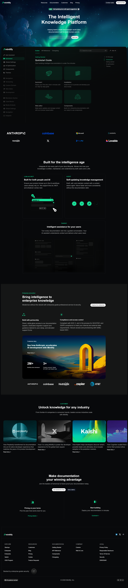

# Mintlify Documentation Website Assignment

This project is the Mintlify website, developed using pure HTML and CSS.

Original Website: https://www.mintlify.com/

---

## Demo

🔗 Live : https://jolly-moonbeam-c70e70.netlify.app/

---

## 📸 Screenshots

---

## Sections Recreated

The following sections were implemented based on the assignment requirements:

1. Top Navigation Bar  
2. Hero Section (Headline, Description, Email CTA, Background)  
3. Documentation Preview Section (Static Sidebar + Content Cards)  
4. Trusted By / Company Logos  
5. Feature Highlights (Two-column Layouts)  
6. Intelligent Assistant / UI Preview  
7. Enterprise Features Section  
8. Case Studies / Customer Stories  
9. Final Call-To-Action Section  
10. Footer (Company & Legal Links)

All sections were structured to closely match the original Mintlify documentation layout.

---

## Tech Stack

- HTML5
- CSS3
---

